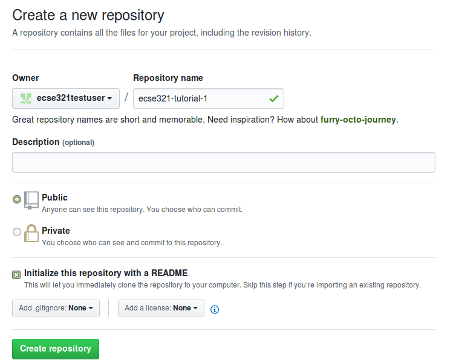
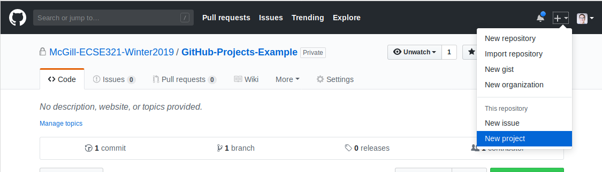
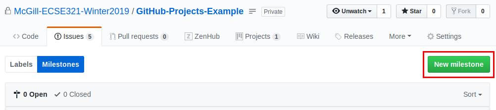

=== Project Management Tools for Agile Development

==== GitHub Projects

First, we create a new repository under everyone's own account to demonstrate the basic features of "GitHub Projects".

. Visit https://github.com/ then click on _New repository_ (green buttom on the right).

. Set your user as the owner of the repository.

. Give a name for the repository (e.g., ecse321-tutorial-1), leave it _public_, then check _Initialize this repository with a README_. Click on _Create repository_ afterwards. At this point the remote repository is ready to use. +

Once the repository is ready, associate a new GitHub Project and see how their features work. Create a project: +

Select Basic Kanban project style: +
image:figs/github-basic-kanban.png[Basic Kanban project]

===== Tasks to complete:

. Create a few issues to outline the tasks for the first deliverable. Assign them appropriate labels and add yourself as the assignee! +
image:figs/github-issues.png[Creating issues]

. Create a milestone for the issues. +

. Create cards from the issues on the project board.

. See how GitHub track the project progress as you move the cards from the different columns.

