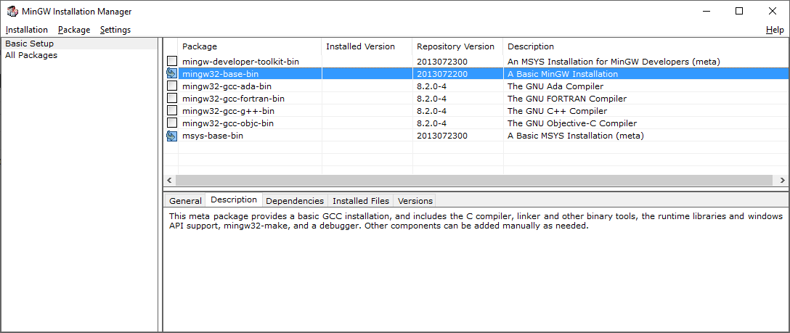
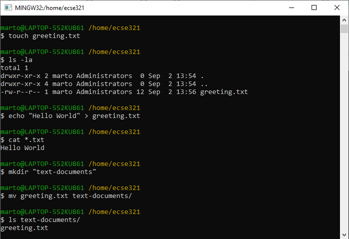
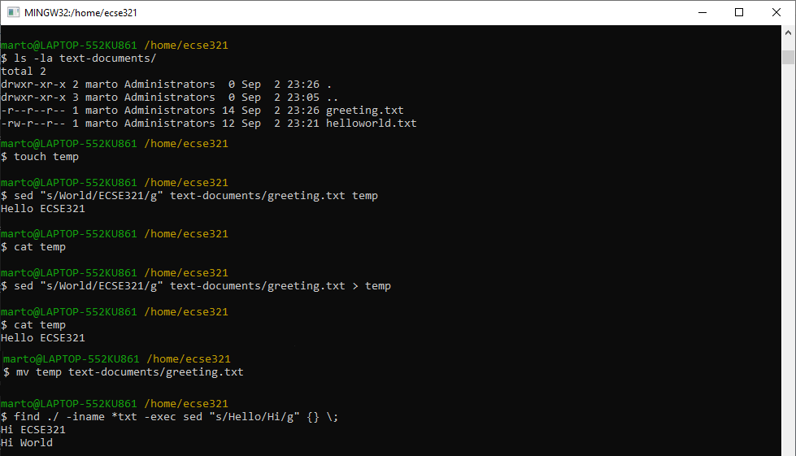

=== Command Line Basics

This section shows a few handy terminal commands.

==== Windows prerequisites

This step can be skipped if you are using MacOS or Linux. However, if you are using Windows, you need to have a terminal that supports the execution of basic Linux commands. Such programs are Git Bash or MinGW, for example. You can find below a few helper steps to get MinGW running on your system.

. Get the link:https://osdn.net/projects/mingw/downloads/68260/mingw-get-setup.exe/[MinGW installer from here]

. Install it to wherever you like, the default installation folder is _C:\MinGW_

. Once the setup finishes, open the MinGW Installation Manager

. Select the two packages for installation as shown in the figure below +


. Click on _Installation/Apply Changes_. This will take a few moments to fetch and install the required packages.

. You can open a terminal window by running the executable _C:\MinGW\msys\1.0\bin\bash.exe_

==== Basic file system operaions

. Open a terminal, and try the following commands: +
 * `pwd`: prints the present working directory +
 Example:
+
```bash
$ pwd
/home/ecse321
```
 * `ls`: lists the content of a given folder +
 Example:
+
```bash
$ ls /home
ecse321 guest-user admin 
```
 * `cd`: navigates the file system +
 Example:
+
```bash
$ cd ..
$ pwd
/home
$ cd ecse321
$ pwd
/home/ecse321
```
+
[NOTE]
The following steps will include images that illustrate the commands and their output to prevent easy copy-paste. Sorry! :)

. Creating files and reading/writing their contents
 * `touch`: creates a file
 * `mkdir`: creates a directory
 * `mv`: moves a file (or directory) from its current location to a target location
 * `echo`: prints a string
 * `cat`: prints the contents of a file +
 Example:
+


==== Finding files
The versatile `find` command allows us to find files based on given criteria. Take look at its manual page with `man find`! 

Example:

image:figs/terminal-find.png[]

==== Batch file operations

 * `sed`: stream editor; changes a given string to a replacement

Combining `find` with an additional command (e.g., `sed`) can greatly speed up your repetitive tasks. + 
Example:



[NOTE]
The file _helloworld.txt_ in the example is initially a copy of _greeting.txt_.

==== Some additional useful commands
 * `rm`: removes a file
 * `cp -r`: copies a directory recursively with its contents
 * `rmdir`: remove an empty directory
 * `rm -rf`: force to recursively delete a directory (or file) and all its contents
 * `nano`: an easy-to-use text editor (not available by default in MinGW)
 * `grep`: finds matches for a string in a given stream of characters
 * `ag`: takes a string as argument and searches through the contents of files recursively to find matches of the given string (this tool is included in the _silversearcher-ag_ package)
