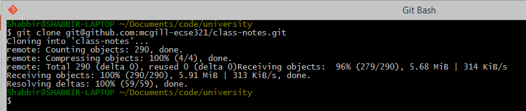
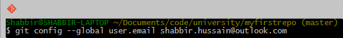
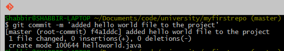
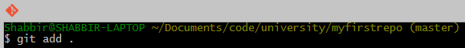

=== Git and GitHub

==== Installing Git

Install the Git version control system (VCS) from https://git-scm.com/downloads.

==== Creating a remote git repository on GitHub

. Go to https://github.com/new

. Set _test_ as the name of the repository

. Check the checkbox _Initialize this repository with a README_

. Click on create repository

==== Cloning to a local repository

. Open up a terminal (Git bash on Windows).

. Navigate to the designated target directory (it is typical to use the `git` folder within the home directory for storing Git repositories, e.g., `cd /home/username/git`).

. Using a Git client, clone this newly created _test_ repository to your computer. First, get the repository URL (use HTTPS for now). +
image:figs/git-repourl.png[Repository URL] +
Then, issue `git clone \https://url/of/the/repository.git` +  
You should get an output similar to this: +

. Verify the contents of the _working copy_ of the repository by `ls -la ./test`. The _.git_ folder holds version information and history for the repository, while the _README.md_ is an auto-generated text file by GitHub.

==== Git basics

. Open up a terminal and configure username and email address. These are needed to identify the author of the different changes. +
image:figs/gitconfig-username.png[Configuring username]
 +
Glossary -- Part 1: 

 * *Git* is your version control software
 * *GitHub* hosts your repositories
 * A *repository* is a collection of files and their history
 * A *commit* is a saved state of the repository

. Enter the working directory, then check the history by issuing `git log`. Example output: +
image:figs/git-log-result.png[Example output for git log]

. Adding and commiting a file: use the `git add` and `git commit` commands. +
image:figs/git-commit1.png[]
image:figs/git-commit2.png[]
 + 
The effect of these commands are explained on the figure below: +
image:figs/git-commit-explained.png[] +
Glossary -- Part 2: 
* *Working Directory*: files being worked on right now
* *Staging area*: files ready to be committed
* *Repository*: A collection of commits 

. Checking current status is done with `git status`. +
image:figs/git-status.png[]

. Staging and unstaging files: use `git add` to add and `git reset` to remove files from the staging area. +

image:figs/git-status-add.png[]
image:figs/git-reset.png[] +
[CAUTION] 
Only staged files will be included in the next commit. 

. To display detailed changes in unstaged files use `git diff`, while use `git diff --staged` to show changes within files staged for commit. +
image:figs/git-diff.png[]

. Reverting to a previous version is done using `git checkout`. +
image:figs/git-checkout.png[]

. The commands `git pull` (or the `git fetch` + `git rebase` combination) and `git push` are used to synchronize local and remote repositories. +
image:figs/git-remote.png[]

==== Browsing commit history on GitHub

. You can browse pushed commits in the remote repository online using GitHub. You can select the _commits_ menu for a repository. +
image:figs/commits-menu.png[width=600] +
To get a link for a specific commit, click on the button with the first few characters of the hash of the commit. +
image:figs/commits-select.png[width=600]

The source for most of the images in the Git documentation: https://github.com/shabbir-hussain/ecse321tutorials/blob/master/01-githubTutorial1.pptx
