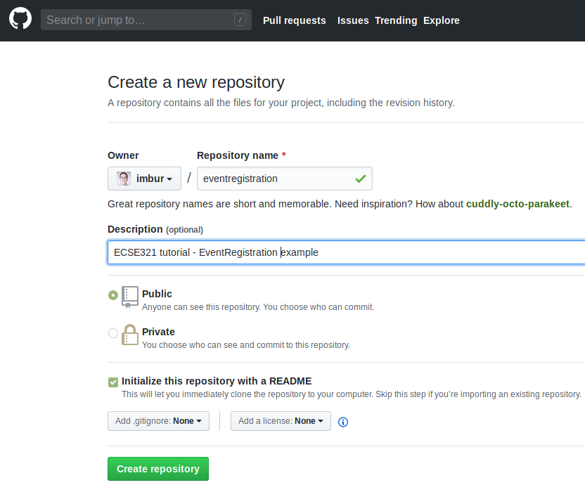

=== Setting up a Spring/Spring Boot backend app with Gradle

. Install the link:https://docs.spring.io/spring-boot/docs/current/reference/html/getting-started-installing-spring-boot.html#getting-started-installing-the-cli[Spring Boot CLI] 

. Create a new repository under your account on GitHub for an example application that we are going to develop throughout the semester. Name the repository *eventregistration*. See more on the specification of the application functionality later. +


. Clone it somewhere on your disk. We assume you cloned it to _~/git/eventregistration_.

. Navigate to that folder in the terminal: `cd ~/git/eventregistration`.

. Create a project for the backend application using Spring Boot CLI in this repository.
+
[source,bash]
----
spring init \
 --build=gradle \
 --java-version=1.8 \
 --package=ca.mcgill.ecse321.eventregistration \
 --name=EventRegistration \
 --dependencies=web,data-jpa,postgresql \
 EventRegistration-Backend
----
+
[NOTE]
Backslashes in this snippet indicate linebreaks in this one liner command typed in the terminal. You can select and copy-paste this snippet as-is.

. Navigate to the _EventRegistration-Backend_ folder

. For future use, locate the _application.properties_ file in the _src/_ folder and add the following content: 
+
```
server.port=${PORT:8080}

spring.jpa.properties.hibernate.temp.use_jdbc_metadata_defaults = false
spring.jpa.database-platform=org.hibernate.dialect.PostgreSQL9Dialect
```
+
[NOTE]
Source: https://vkuzel.com/spring-boot-jpa-hibernate-atomikos-postgresql-exception

. Locate the Java file containing the main application class (`EventRegistrationApplication.java`) and add the following content
+
[source,java]
----
package ca.mcgill.ecse321.eventregistration;

import org.springframework.boot.autoconfigure.SpringBootApplication;
import org.springframework.boot.SpringApplication;
import org.springframework.web.bind.annotation.RestController;
import org.springframework.web.bind.annotation.RequestMapping;

@RestController
@SpringBootApplication
public class EventRegistrationApplication {

  public static void main(String[] args) {
    SpringApplication.run(EventRegistrationApplication.class, args);
  }

  @RequestMapping("/")
  public String greeting(){
    return "Hello world!";
  }
  	
}
----

. Verify that it builds with `gradle build -xtest`. +

. Commit and push the files of the new Spring project.
+
[source,bash]
----
git add .
git status #verify the files that are staged for commit
git commit -m "Initial commit of the backend application"
git push
----
