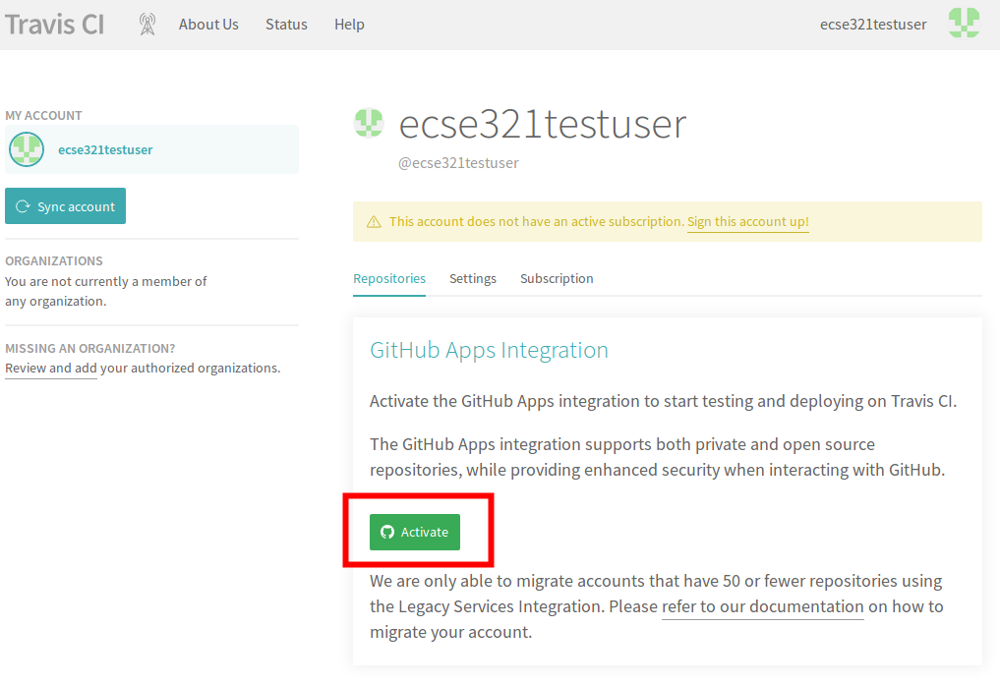

=== Travis CI

. Go to https://travis-ci.com/, click on Sign up with GitHub.

. Click on the green authorize button at the bottom of the page.

. Activate Travis-CI on your GitHub account +

. Select the repositories you want to build with Travis (make sure to include your repository that you created for this tutorial). You can modify this setting anytime later as well.

. [Optional step: skip if you have a gradle project already] In your working copy of your repository, create a default Gradle java project. 
* Make sure you have link:https://gradle.org/install/[Gradle] installed (`gradle --version`).
* Issue `gradle init --type java-library`
* Add a `.gitignore` to ignore generated resources by Git: 
+
[source]
----
.gradle/
build/
----
* Make sure your application is compiling by running `gradle build`

. Create a file called `.travis.yml`:
+
[source]
----
language: java
script:
- gradle build
----
. Commit and push your work. If everything is set up correctly, the build should trigger and Travis should run your build using Gradle.
