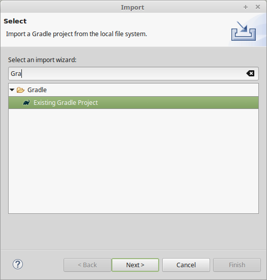
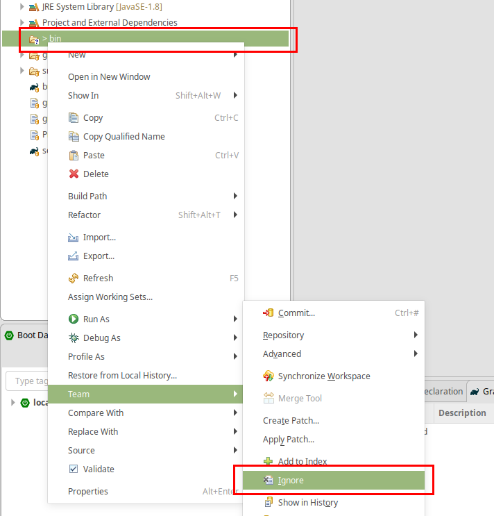
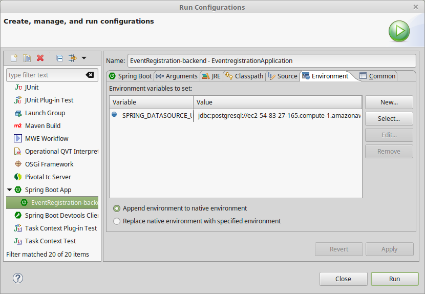

=== Setting up a Spring-based Backend

You can download the Spring Tools Suite IDE from link:https://spring.io/tools[here].

==== Running the Backend Application from Eclipse

. Import the *EventRegistration-Backend* Spring Boot project as a Gradle project from _File > Import... > Gradle > Existing Gradle project_ using the default settings. Select the previously generated Spring project folder as the root of the project. +


. Ignore the bin folder. +


. Find the `EventRegistrationApplication.java` source file, then right click and select _Run As > Spring Boot App_. The application will fail to start, since the database is not yet configured, but this action will create an initial run configuration. Example console output (fragment):
+
```
[...]
***************************
APPLICATION FAILED TO START
***************************

Description:

Failed to configure a DataSource: 'url' attribute is not specified and no embedded datasource could be configured.

Reason: Failed to determine a suitable driver class
[...]
```

. Obtain the database URL to access the database remotely, e.g., by opening up a terminal and running: `heroku run echo \$JDBC_DATABASE_URL --app=<YOUR_BACKEND_APP_NAME>`.

. In Eclipse, open the _EventRegistration-Backend - EventregistrationApplication_ run configuration page and add an environment variable called `SPRING_DATASOURCE_URL` with the value obtained in the previous step. +


. Add the `spring.jpa.hibernate.ddl-auto=update` to `application.properties`. The database content along with the tables this way will be deleted (as necessary) then re-created each time your application starts. +
[IMPORTANT]
In production, the value of this property should be `none` (instead of `update`). Possible values are `none`, `create`, `validate`, and `update`.

. If needed: troubleshooting:
 * If you get an error message saying something similar to `createClob() is not yet implemented`, then you can try setting the `spring.jpa.properties.hibernate.jdbc.lob.non_contextual_creation=true` variable in your `application.properties`. It could be a workaround a workaround for an issue with Postgres. +
 * Sometimes environment variables don't work with Spring apps. In this case you can set the `spring.datasource.url`, the `spring.datasource.username`, and the `spring.datasource.password` variables in the application properties as an alternative to setting the `SPRING_DATASOURCE_URL` environment variable. +
 * Make sure no other apps are running on link:localhost:8080[localhost:8080]. You can test it by opening the browser and entering `localhost:8080` as the address.


==== Spring Transactions
. *Verify* the contents of the `EventRegistrationApplication` class: 
+ 
[source,java]
----
package ca.mcgill.ecse321.eventregistration;

import org.springframework.boot.autoconfigure.SpringBootApplication;
import org.springframework.boot.SpringApplication;
import org.springframework.web.bind.annotation.RestController;
import org.springframework.web.bind.annotation.RequestMapping;

@RestController
@SpringBootApplication
public class EventRegistrationApplication {

	public static void main(String[] args) {
		SpringApplication.run(EventRegistrationApplication.class, args);
	}

	@RequestMapping("/")
	public String greeting() {
		return "Hello world!";
	}
}
----

. Create a new package in `src/main/java` and name it `ca.mcgill.ecse321.eventregistration.dao`.

. Create the `EventRegistrationRepository` class within this new package
+
[source,java]
----
package ca.mcgill.ecse321.eventregistration.dao;

import java.sql.Date;
import java.sql.Time;
import java.util.List;

import javax.persistence.EntityManager;
import javax.persistence.TypedQuery;

import org.springframework.beans.factory.annotation.Autowired;
import org.springframework.stereotype.Repository;
import org.springframework.transaction.annotation.Transactional;

import ca.mcgill.ecse321.eventregistration.model.Person;
import ca.mcgill.ecse321.eventregistration.model.Event;

@Repository
public class EventRegistrationRepository {

	@Autowired
	EntityManager entityManager;

	@Transactional
	public Person createPerson(String name) {
		Person p = new Person();
		p.setName(name);
		entityManager.persist(p);
		return p;
	}
	
	@Transactional
	public Person getPerson(String name) {
		Person p = entityManager.find(Person.class, name);
		return p;
	}
	
	@Transactional
	public Event createEvent(String name, Date date, Time startTime, Time endTime) {
		Event e = new Event();
		e.setName(name);
		e.setDate(date);
		e.setStartTime(startTime);
		e.setEndTime(endTime);
		entityManager.persist(e);
		return e;
	}
	
	@Transactional
	public Event getEvent(String name) {
		Event e = entityManager.find(Event.class, name);
		return e;
	}
	
}
----

. Add a new method that gets all events before a specified date (`deadline`). Use a typed query created from an SQL command:
+
[source,java]
----
@Transactional
public List<Event> getEventsBeforeADeadline(Date deadline) {
	TypedQuery<Event> q = entityManager.createQuery("select e from Event e where e.date < :deadline",Event.class);
	q.setParameter("deadline", deadline);
	List<Event> resultList = q.getResultList();
	return resultList;
}
----

[NOTE]
To try the methods, you can create a JUnit test under _src/test/java_. Currently the methods in `EventRegistrationRepository` directly access the objects stored in the database via the `EntityManager` instance and these methods should implement both database operations and service business logic (including input validation -- which we omitted in this part). In later sections, however, we will see how we can easily separate the database access and the service business logic in Spring applications.

==== Debugging: connecting to the database using a client

There are cases when a developer wants to know the contents of the database. In this case, a database client program can be used to access the database schema and table contents. Here are the general steps to access the Postgres database provided by Heroku:

. Obtain the database URL to access the database remotely, e.g., by opening up a terminal and running: `heroku run echo \$JDBC_DATABASE_URL --app=<YOUR_BACKEND_APP_NAME>`.

. The returned value follows the format that holds all main important parameters that are needed for accessing the database server:
+
```
jdbc:postgresql://<HOST>:<PORT>/<DATABASE_NAME>?user=<USERNAME>&password=<PASSWORD>&sslmode=require
```
+
These parameters are:

 * Database host: the URL for the server
 * Port: the por on which the DB server is listening
 * Database name: the first section after the URL
 * Username: the first parameter value in the provided URL
 * Password: the second parameter value in the provided URL

. With these parameters you can use any Postgres client you prefer to connect to the database. Here is an example for such a connection from Linux using `postgres-client`:
+
[source,bash]
----
$> psql postgresql://ec2-54-243-223-245.compute-1.amazonaws.com:5432/d4412g60aaboa7?user=hdjnflfirvkmmr
Password:
psql (10.6 (Ubuntu 10.6-0ubuntu0.18.04.1))
SSL connection (protocol: TLSv1.2, cipher: ECDHE-RSA-AES256-GCM-SHA384, bits: 256, compression: off)
Type "help" for help.

d4412g60aaboa7=> \dt
                          List of relations
 Schema |                Name                | Type  |     Owner      
--------+------------------------------------+-------+----------------
 public | event                              | table | hdjnflfirvkmmr
 public | person                             | table | hdjnflfirvkmmr
 public | registration                       | table | hdjnflfirvkmmr
 public | registration_manager               | table | hdjnflfirvkmmr
 public | registration_manager_events        | table | hdjnflfirvkmmr
 public | registration_manager_persons       | table | hdjnflfirvkmmr
 public | registration_manager_registrations | table | hdjnflfirvkmmr
(7 rows)

d4412g60aaboa7=> select * from event ;
 name |    date    | end_time | start_time 
------+------------+----------+------------
 e1   | 3899-10-09 | 12:00:00 | 10:00:00
(1 row)

d4412g60aaboa7=> \q
$>
----
