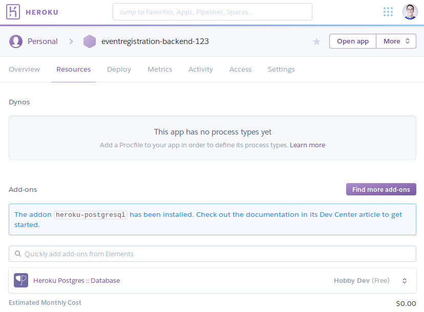
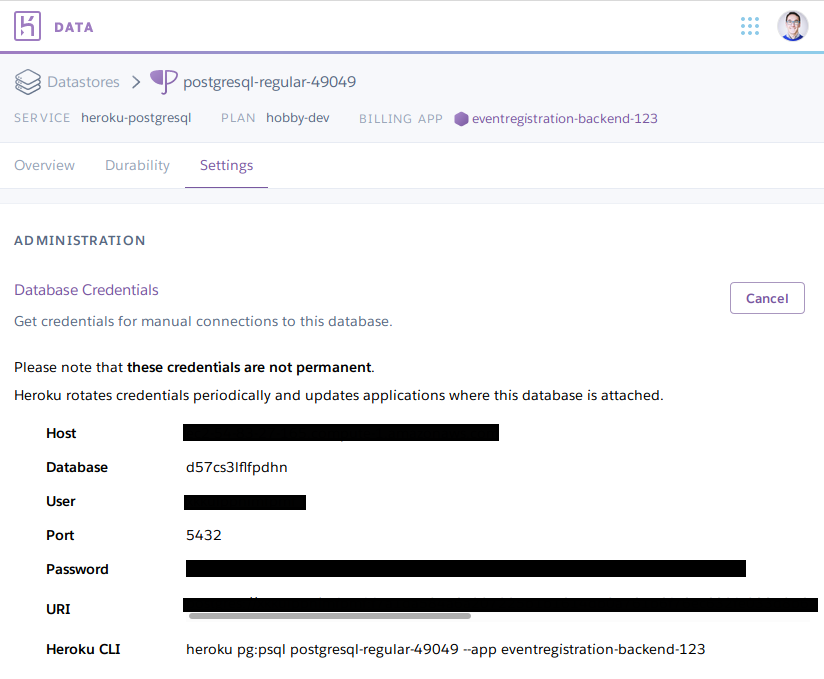

=== Heroku

==== Preparations

. Sign up/log in on Heroku by visiting https://www.heroku.com/.

. Install the command line client for Heroku: https://devcenter.heroku.com/articles/heroku-cli[Heroku CLI]
+
[NOTE]
The Travis client might also be useful at later stages of the course, you can install it from here: https://github.com/travis-ci/travis.rb#readme[Travis CLI]

. Log in to Heroku CLI by opening a terminal an typing: `heroku login`.

==== Creating a Heroku app

We are creating a Heroku application and deploying the _Hello world!_ Spring example. Additionally, the steps below will make it possible to store multiple different applications in the same git repository and deploy them individually to Heroku. Steps will be shown through the example EventRegistration application, and should be adapted in the course project.

[NOTE]
All actions described here for configuring Heroku applications using the Heroku CLI could also be done via the web UI.

. Once you are logged in with the Heroku-CLI, create a new Heroku application: in the root of the git repository of your repository (assumed to be _~/git/eventregistration_), issue `heroku create eventregistration-backend-<UNIQUE_ID> -n` to create an application named "eventregistration-backend-<UNIQUE_ID>". +
[NOTE]
In Heroku, the application name should be unique Heroku-wise, that is, each application in Heroku's system should have a unique name. If you don't provide a name parameter for the command, Heroku will randomly generate one.

. Add the link:https://elements.heroku.com/buildpacks/heroku/heroku-buildpack-multi-procfile[multi procfile] and link:https://elements.heroku.com/buildpacks/heroku/heroku-buildpack-gradle[Gradle] buildpacks to the app.
+
[source,bash,line]
----
heroku buildpacks:add -a eventregistration-backend-<UNIQUE_ID> https://github.com/heroku/heroku-buildpack-multi-procfile
heroku buildpacks:add -a eventregistration-backend-<UNIQUE_ID> heroku/gradle
----
+
[CAUTION]
Order is important.

==== Adding a database to the application

. Open the Heroku applications web page and go to _Resources_, then add the Heroku Postgres add-on. +
 +

. Click the entry for Postgres within the list of add-ons, then go to _Settings_. You can see the database credentials there. 
 +
[NOTE]
The credentials are periodically updated and changed by Heroku, so make sure that you are using the actual credentials when manually connecting to the database. (E.g., during manual testing.)


==== Extending the build for the Heroku deployment environment

. Before deploying, a top level _build.gradle_ and _settings.gradle_ need to be created in the root of the repository (i.e., in _~/git/eventregistration_) +
_build.gradle_:
+
[source,gradle]
----
task stage () {
    dependsOn ':EventRegistration-Backend:assemble'
}
----
_settings.gradle_:
+
[source,gradle]
----
include ':EventRegistration-Backend'
----

. Generate the Gradle wrapper with the newest Gradle version
+
[source,bash]
----
gradle wrapper --gradle-version 5.6.2
----

. Create a _.gitignore_ file for the _.gradle_ folder: +
_.gitignore_: 
+
```
.gradle/
```

. Add all new files to git
+
[source,bash]
----
git add .
git status #make sure that files in .gradle/ are not added
----
+
Expected output for `git status`:
+
[source,bash]
----
On branch master
Your branch is ahead of 'origin/master' by 2 commits.
  (use "git push" to publish your local commits)

Changes to be committed:
  (use "git reset HEAD <file>..." to unstage)

	new file:   .gitignore
	new file:   build.gradle
	new file:   gradle/wrapper/gradle-wrapper.jar
	new file:   gradle/wrapper/gradle-wrapper.properties
	new file:   gradlew
	new file:   gradlew.bat
	new file:   settings.gradle
----
+
Commit changes:
+
[source,bash]
----
git commit -m "Adding Gradle wrapper"
----

==== Supply application-specific setting for Heroku

. Within the _EventRegistration-Backend_ folder, create a file called _Procfile_ (*not* Procfile.txt, name it *exactly* Procfile) with the content: 
+
```
web: java -jar EventRegistration-Backend/build/libs/EventRegistration-Backend-0.0.1-SNAPSHOT.jar
```

. Add the Procfile to a new commit

. Configure the multi-procfile buildpack to find the Procfile: 
+
[source,bash]
----
heroku config:add PROCFILE=EventRegistration-Backend/Procfile --app eventregistration-backend-<UNIQUE_ID>
----

==== Deploying the app

. Obtain and copy the _Heroku Git URL_ 
+
[source,bash]
----
heroku git:remote --app eventregistration-backend-<UNIQUE_ID> --remote backend-heroku
----
+
Output:
+
[source,bash]
----
set git remote backend-heroku to https://git.heroku.com/eventregistration-backend-<UNIQUE_ID>.git
----

. Verify that the `backend-heroku` remote is successfully added besides `origin` with `git remote -v`. Output:
+
[source,bash]
----
backend-heroku	https://git.heroku.com/eventregistration-backend-123.git (fetch)
backend-heroku	https://git.heroku.com/eventregistration-backend-123.git (push)
origin	git@github.com:imbur/eventregistration.git (fetch)
origin	git@github.com:imbur/eventregistration.git (push)
----

. Deploy your application with
+
[source,bash]
git push backend-heroku master
+
[NOTE]
If it fails to build, make sure you try understanding the output. Typical issue: buildpacks are not added/are not in the right order.

. Visit the link provided in the build output. It may take some time (even 30-60 seconds) for the server to answer the first HTTP request, so be patient!

. Save your work to the GitHub repository, too: `git push origin master` +
Final layout of the files (only two directory levels are shown and hidden items are suppressed): +
[source,none]
----
~/git/eventregistration
├── build.gradle
├── EventRegistration-Backend
│   ├── build
│   │   ├── classes
│   │   ├── libs
│   │   ├── resources
│   │   └── tmp
│   ├── build.gradle
│   ├── gradle
│   │   └── wrapper
│   ├── gradlew
│   ├── gradlew.bat
│   ├── Procfile
│   ├── settings.gradle
│   └── src
│       ├── main
│       └── test
├── gradle
│   └── wrapper
│       ├── gradle-wrapper.jar
│       └── gradle-wrapper.properties
├── gradlew
├── gradlew.bat
├── README.md
└── settings.gradle
----