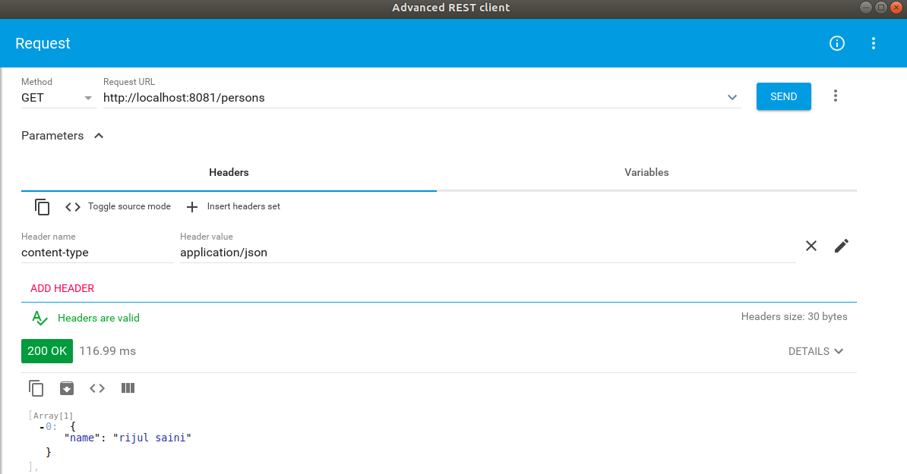
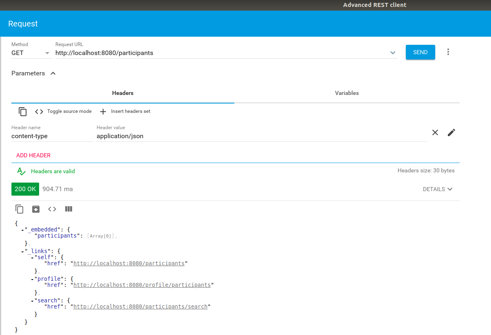

=== Creating RESTful Web Services in Spring

The following steps provide guidance on (1) implementing business logic that implements the required functionality (classes annotated with `@Service`) and (2) exposing them using a REST API in the context of the Event Registration Application (classes annotated with `@RestController`).

==== Implementing Service Methods

We implement use-cases in _service classes_ by using the DAOs for each data type of the domain model.

. In _src/main/java_, create a new package `ca.mcgill.ecse321.eventregistration.service`.

. In this package, create the `EventRegistrationService` class as shown below
+
[source,java]
----
package ca.mcgill.ecse321.eventregistration.service;

import java.sql.Date;
import java.sql.Time;
import java.util.ArrayList;
import java.util.List;

import org.springframework.beans.factory.annotation.Autowired;
import org.springframework.stereotype.Service;
import org.springframework.transaction.annotation.Transactional;

import ca.mcgill.ecse321.eventregistration.dao.EventRepository;
import ca.mcgill.ecse321.eventregistration.dao.PersonRepository;
import ca.mcgill.ecse321.eventregistration.dao.RegistrationRepository;
import ca.mcgill.ecse321.eventregistration.model.Event;
import ca.mcgill.ecse321.eventregistration.model.Person;
import ca.mcgill.ecse321.eventregistration.model.Registration;

@Service
public class EventRegistrationService {

	@Autowired
	EventRepository eventRepository;
	@Autowired
	PersonRepository personRepository;
	@Autowired
	RegistrationRepository registrationRepository;

	@Transactional
	public Person createPerson(String name) {
		Person person = new Person();
		person.setName(name);
		personRepository.save(person);
		return person;
	}

	@Transactional
	public Person getPerson(String name) {
		Person person = personRepository.findPersonByName(name);
		return person;
	}
	
	@Transactional
	public List<Person> getAllPersons() {
		return toList(personRepository.findAll());
	}

	@Transactional
	public Event createEvent(String name, Date date, Time startTime, Time endTime) {
		Event event = new Event();
		event.setName(name);
		event.setDate(date);
		event.setStartTime(startTime);
		event.setEndTime(endTime);
		eventRepository.save(event);
		return event;
	}

	@Transactional
	public Event getEvent(String name) {
		Event event = eventRepository.findEventByName(name);
		return event;
	}

	@Transactional
	public List<Event> getAllEvents() {
		return toList(eventRepository.findAll());
	}

	@Transactional
	public Registration register(Person person, Event event) {
		Registration registration = new Registration();
		registration.setId(person.getName().hashCode() * event.getName().hashCode());
		registration.setPerson(person);
		registration.setEvent(event);

		registrationRepository.save(registration);

		return registration;
	}

	@Transactional
	public List<Registration> getAllRegistrations(){
		return toList(registrationRepository.findAll());
	}

	@Transactional
	public List<Event> getEventsAttendedByPerson(Person person) {
		List<Event> eventsAttendedByPerson = new ArrayList<>();
		for (Registration r : registrationRepository.findByPerson(person)) {
			eventsAttendedByPerson.add(r.getEvent());
		}
		return eventsAttendedByPerson;
	}
	
	private <T> List<T> toList(Iterable<T> iterable){
		List<T> resultList = new ArrayList<T>();
		for (T t : iterable) {
			resultList.add(t);
		}
		return resultList;
	}
	
}
----

==== Exposing Service Functionality via a RESTful API

===== Building a RESTful Web Service Using a Controller and Data Transfer Objects

. We first create a new package `ca.mcgill.ecse321.eventregistration.controller` in EventRegistration-Backend and then create `EventRegistrationRestController` class inside it. We add the annotation `@RestController` to the controller class so that HTTP requests can be dispacthed to `EventRegistrationRestController` class. In addition, we enabled the link:https://developer.mozilla.org/en-US/docs/Web/HTTP/CORS[Cross-Origin Resource Sharing] for any domain using the `@CrossOrigin` annotation on the REST controller class.
+
[source,java]
----
package ca.mcgill.ecse321.eventregistration.controller;

import org.springframework.web.bind.annotation.CrossOrigin;
import org.springframework.web.bind.annotation.RestController;

@CrossOrigin(origins = "*")
@RestController
public class EventRegistrationRestController {

	@Autowired
	private EventRegistrationService service;

}
----

. We further create another package ca.mcgill.ecse321.eventregistration.dto and create the below Data Transfer Object (DTO) classes inside that package. First we create EventDto.java.
+
[IMPORTANT]
Data Access Object (DAO) != Data Transfer Object (DTO). These two are completely separate concepts, as you will also see below. These two should not be confused with each other.
+
[source,java]
----
package ca.mcgill.ecse321.eventregistration.dto;

import java.sql.Date;
import java.sql.Time;

public class EventDto {

	private String name;
	private Date eventDate;
	private Time startTime;
	private Time endTime;

	public EventDto() {
	}

	public EventDto(String name) {
		this(name, Date.valueOf("1971-01-01"), Time.valueOf("00:00:00"), Time.valueOf("23:59:59"));
	}

	public EventDto(String name, Date eventDate, Time startTime, Time endTime) {
		this.name = name;
		this.eventDate = eventDate;
		this.startTime = startTime;
		this.endTime = endTime;
	}

	public String getName() {
		return name;
	}

	public Date getEventDate() {
		return eventDate;
	}

	public Time getStartTime() {
		return startTime;
	}

	public Time getEndTime() {
		return endTime;
	}

}
----

. Next, we create `PersonDto` Java class.
+
[source,java]
----
package ca.mcgill.ecse321.eventregistration.dto;

import java.util.Collections;
import java.util.List;

public class PersonDto {

	private String name;
	private List<EventDto> events;

	public PersonDto() {
	}

	@SuppressWarnings("unchecked")
	public PersonDto(String name) {
		this(name, Collections.EMPTY_LIST);
	}

	public PersonDto(String name, List<EventDto> arrayList) {
		this.name = name;
		this.events = arrayList;
	}

	public String getName() {
		return name;
	}

	public List<EventDto> getEvents() {
		return events;
	}

	public void setEvents(List<EventDto> events) {
		this.events = events;
	}

}
----

. Finally, we create `RegistrationDto` Java class.
+
[source,java]
----
package ca.mcgill.ecse321.eventregistration.dto;

public class RegistrationDto {

	private PersonDto person;
	private EventDto event;
	
	public RegistrationDto() {
	}

	public RegistrationDto(PersonDto person, EventDto event) {
		this.person = person;
		this.event = event;
	}
	
	public PersonDto getperson() {
		return person;
	}
	
	public void setperson(PersonDto person) {
		this.person = person;
	}

	public EventDto getEvent() {
		return event;
	}

	public void setEvent(EventDto event) {
		this.event = event;
	}
}
----

. We start adding the methods in the `EventRegistrationRestController` class. Also, we will add annotaions to map HTTP requests.
+
[TIP]
In Spring Tools Suite (a.k.a. Eclipse), you can organize Java imports with kbd:[Ctrl+Shift+o]
+
[source,java]
----
@GetMapping(value = { "/persons", "/persons/" })
public List<PersonDto> getAllPersons() {
	return service.getAllPersons().stream().map(p -> convertToDto(p)).collect(Collectors.toList());
}

@PostMapping(value = { "/persons/{name}", "/persons/{name}/" })
public PersonDto createPerson(@PathVariable("name") String name) throws IllegalArgumentException {
	Person person = service.createPerson(name);
	return convertToDto(person);
}
----
+
The `@RequestMapping` annotation is used to map HTTP requests to Spring Controller methods. Since, `@RequestMapping` maps all HTTP operations by default. We can use `@GetMapping`, `@PostMapping` and so forth to narrow this mapping to specific HTTP operations.
+
Moreover, in the above snippet, we use the `value` parameter of `@PathVariable` annotation to bind the value of the query string parameter name into the name parameter of the `createPerson()` method.

. You can add other methods similarly with appropriate mappings.
+
[source,java]
----
@PostMapping(value = { "/events/{name}", "/events/{name}/" })
public EventDto createEvent(@PathVariable("name") String name, @RequestParam Date date,
@RequestParam @DateTimeFormat(iso = DateTimeFormat.ISO.TIME, pattern = "HH:mm") LocalTime startTime,
@RequestParam @DateTimeFormat(iso = DateTimeFormat.ISO.TIME, pattern = "HH:mm") LocalTime endTime)
throws IllegalArgumentException {
	Event event = service.createEvent(name, date, Time.valueOf(startTime), Time.valueOf(endTime));
	return convertToDto(event);
}

@GetMapping(value = { "/events", "/events/" })
public List<EventDto> getAllEvents() {
	List<EventDto> eventDtos = new ArrayList<>();
	for (Event event : service.getAllEvents()) {
		eventDtos.add(convertToDto(event));
	}
	return eventDtos;
}

@PostMapping(value = { "/register", "/register/" })
public RegistrationDto registerPersonForEvent(@RequestParam(name = "person") PersonDto pDto,
	@RequestParam(name = "event") EventDto eDto) throws IllegalArgumentException {
	Person p = service.getPerson(pDto.getName());
	Event e = service.getEvent(eDto.getName());

	Registration r = service.register(p, e);
	return convertToDto(r, p, e);
}

@GetMapping(value = { "/registrations/person/{name}", "/registrations/person/{name}/" })
public List<EventDto> getEventsOfPerson(@PathVariable("name") PersonDto pDto) {
	Person p = convertToDomainObject(pDto);
	return createEventDtosForPerson(p);
}

@GetMapping(value = { "/events/{name}", "/events/{name}/" })
public EventDto getEventByName(@PathVariable("name") String name) throws IllegalArgumentException {
	return convertToDto(service.getEvent(name));
}

private EventDto convertToDto(Event e) {
	if (e == null) {
		throw new IllegalArgumentException("There is no such Event!");
	}
	EventDto eventDto = new EventDto(e.getName(),e.getDate(),e.getStartTime(),e.getEndTime());
	return eventDto;
}

private PersonDto convertToDto(Person p) {
	if (p == null) {
		throw new IllegalArgumentException("There is no such Person!");
	}
	PersonDto personDto = new PersonDto(p.getName());
	personDto.setEvents(createEventDtosForPerson(p));
	return personDto;
}

private RegistrationDto convertToDto(Registration r, Person p, Event e) {
	EventDto eDto = convertToDto(e);
	PersonDto pDto = convertToDto(p);
	return new RegistrationDto(pDto, eDto);
}

private Person convertToDomainObject(PersonDto pDto) {
	List<Person> allPersons = service.getAllPersons();
	for (Person person : allPersons) {
		if (person.getName().equals(pDto.getName())) {
			return person;
		}
	}
	return null;
}

private List<EventDto> createEventDtosForPerson(Person p) {
	List<Event> eventsForPerson = service.getEventsAttendedByPerson(p);
	List<EventDto> events = new ArrayList<>();
	for (Event event : eventsForPerson) {
		events.add(convertToDto(event));
	}
	return events;
}
----

===== Trying (Smoke Testing of) the Application

We can see if our application is able to respond to HTTP requests using, e.g., the Postman (Chrome), RESTClient browser plugin (Firefox), Advanced Rest Client (Firefox), or the command line tool called `curl`.

Once you launch the client, you can specify the path and select the method as shown in the below figures.

image:figs/RestClient1.png[Post method on REST Client,width=1000]

Once we use POST, the record is persisted and then we can use the GET method to retrive the same.

Similary, we can try other methods as well.

==== Spring Data - an Alternative Way to Expose Application Data via a RESTful Interface

The advantage of using _Spring Data Rest_ is that it can remove a lot of boilerplate compared to the previous sections. Spring would automatically create endpoints for classes, such as `/events` and `/person` in the Event Registration example. In this case, implementing proper error handling may require some extra effort (not discussed here).

[NOTE]
This section presents an alternative way of exposing your data via a REST API. **You do not have to use this method** if you do not think that it fits your design.

. Add the dependency 'spring-boot-starter-data-rest' in _build.gradle_ file of your backend. It is required to expose Spring Data repositories over REST using Spring Data REST. Update your `dependencies` section as shown below:
+
[source,gradle]
----
dependencies {
	implementation 'org.springframework.boot:spring-boot-starter-data-jpa'
	implementation 'org.springframework.boot:spring-boot-starter-web'
	implementation 'org.springframework.boot:spring-boot-starter-data-rest'

	runtimeOnly 'org.postgresql:postgresql'
	testImplementation('org.springframework.boot:spring-boot-starter-test') {
		exclude group: 'org.junit.vintage', module: 'junit-vintage-engine'
	}
}
----

. We have already added the dependency `spring-boot-starter-data-rest` exposes DAOs over RESTful endpoints using Spring Data REST.

. Next, we can go to repository interfaces and add a `@RepositoryRestResource` annotaion.
+
[source,java]
----
// REST endpoint specification
@RepositoryRestResource(collectionResourceRel = "person_data", path = "person_data")
public interface PersonRepository extends CrudRepository<Person, String>{
	
	Person findPersonByName(String name);
	
}
----

. Finally, we can access this REST API (`http://localhost:8080/person_data`) in the browser or REST Client and will receive the JSON as shown below. 
+

. Exercise: turn on this _Spring Data JPA_ feature for events and registrations, too.

. Question: what information do we see in the response?

==== Testing Services

. See the link:https://gist.githubusercontent.com/imbur/d8836dc9f44ece65186a43ac80a259fd/raw/b60ddaf6c86860abe119908b139ca087f1f5ff6e/TestEventRegistrationService.java[complete test suite here].

. Run the tests and interpret the test error messages! You should see only a few (at least one) tests passing.

. Update the implementation (i.e., replace the current service method codes with the ones provided below) of the following methods with input validation in the `EventRegistrationService` service class to make the tests pass (Test-Driven Development)
+
[source,java]
----
@Transactional
public Person createPerson(String name) {
	if (name == null || name.trim().length() == 0) {
		throw new IllegalArgumentException("Person name cannot be empty!");
	}
	Person person = new Person();
	person.setName(name);
	personRepository.save(person);
	return person;
}
----
+
[source,java]
----
@Transactional
public Person getPerson(String name) {
    if (name == null || name.trim().length() == 0) {
        throw new IllegalArgumentException("Person name cannot be empty!");
    }
    Person person = personRepository.findPersonByName(name);
    return person;
}
----
+
[source,java]
----
@Transactional
public Event getEvent(String name) {
    if (name == null || name.trim().length() == 0) {
        throw new IllegalArgumentException("Event name cannot be empty!");
    }
    Event event = eventRepository.findEventByName(name);
    return event;
}
----
+
[source,java]
----
@Transactional
public Event createEvent(String name, Date date, Time startTime, Time endTime) {
    // Input validation
    String error = "";
    if (name == null || name.trim().length() == 0) {
        error = error + "Event name cannot be empty! ";			
    }
    if (date == null) {
        error = error + "Event date cannot be empty! ";			
    }
    if (startTime == null) {
        error = error + "Event start time cannot be empty! ";			
    }
    if (endTime == null) {
        error = error + "Event end time cannot be empty! ";			
    }
    if (endTime != null && startTime != null && endTime.before(startTime)) {
        error = error + "Event end time cannot be before event start time!";			
    }
    error = error.trim();
    if (error.length() > 0) {
        throw new IllegalArgumentException(error);			
    }

    Event event = new Event();
    event.setName(name);
    event.setDate(date);
    event.setStartTime(startTime);
    event.setEndTime(endTime);
    eventRepository.save(event);
    return event;
}
----
+
[source,java]
----
@Transactional
public Registration register(Person person, Event event) {
    String error = "";
    if (person == null) {
        error = error + "Person needs to be selected for registration! ";
    } else if (!personRepository.existsById(person.getName())) {
        error = error + "Person does not exist! ";
    }
    if (event == null) {
        error = error + "Event needs to be selected for registration!";
    } else if (!eventRepository.existsById(event.getName())) {
        error = error + "Event does not exist!";
    }
    if (registrationRepository.existsByPersonAndEvent(person, event)) {
        error = error + "Person is already registered to this event!";
    }
    error = error.trim();

    if (error.length() > 0) {			
        throw new IllegalArgumentException(error);
    }

    Registration registration = new Registration();
	registration.setId(person.getName().hashCode() * event.getName().hashCode());
    registration.setPerson(person);
    registration.setEvent(event);

    registrationRepository.save(registration);

    return registration;
}
----
+
[source,java]
----
@Transactional
public List<Event> getEventsAttendedByPerson(Person person) {
    if (person == null ) {
        throw new IllegalArgumentException("Person cannot be null!");
    }
    List<Event> eventsAttendedByPerson = new ArrayList<>();
    for (Registration r : registrationRepository.findByPerson(person)) {
        eventsAttendedByPerson.add(r.getEvent());
    }
    return eventsAttendedByPerson;
}
----

. Run the tests again, and all should be passing this time.
 

Previously, we used CRUD repository objects for each data type of the domain model and implemented use-cases in service classes. In this section, we will Implement REST API for eventregistration (people, events and registrations) 

and expose Sping Data.

If you would like to, you can obtain a version of the project that already has the changes from the previous tutorials link:https://github.com/imbur/eventregistration-w2020[here].

