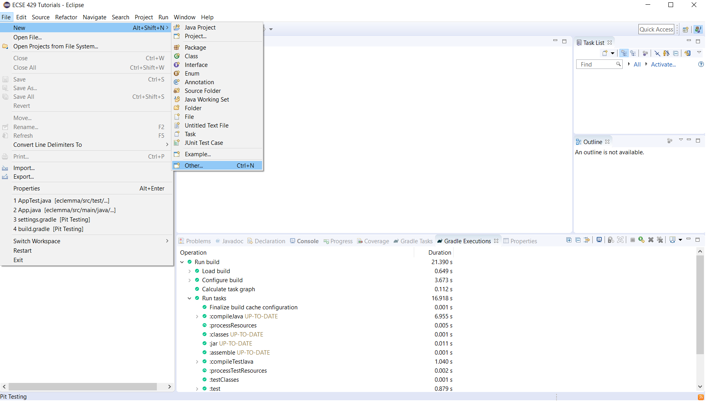
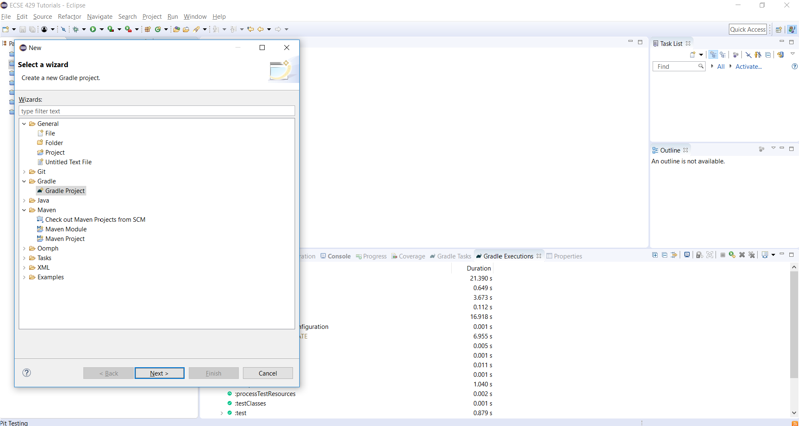
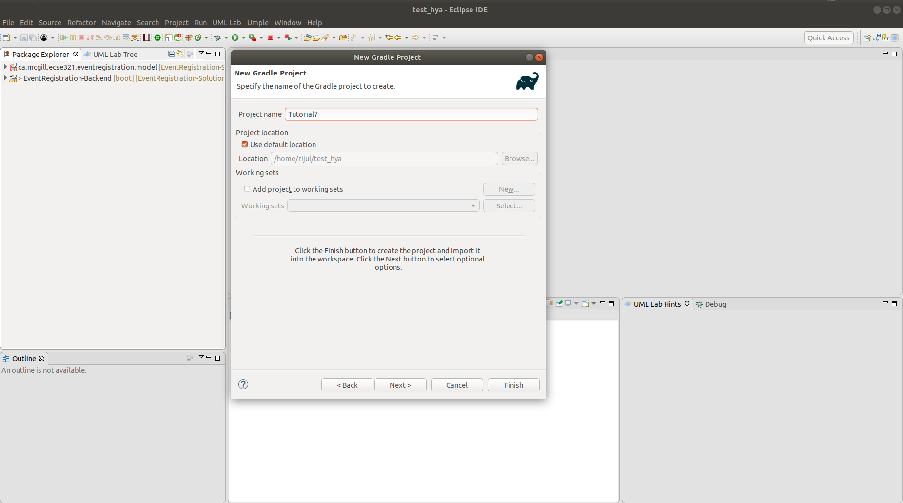
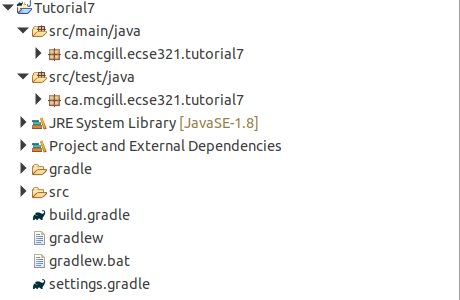
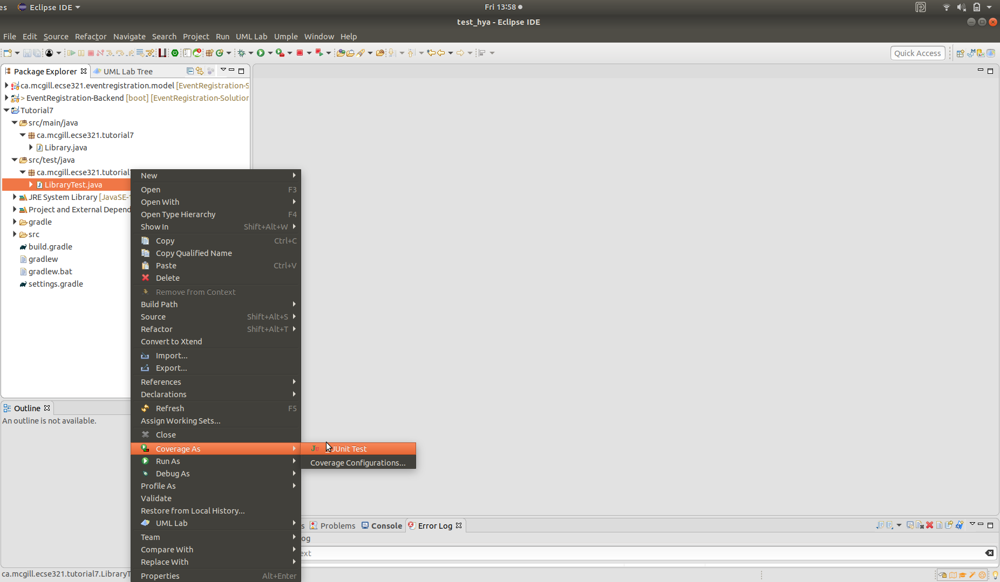
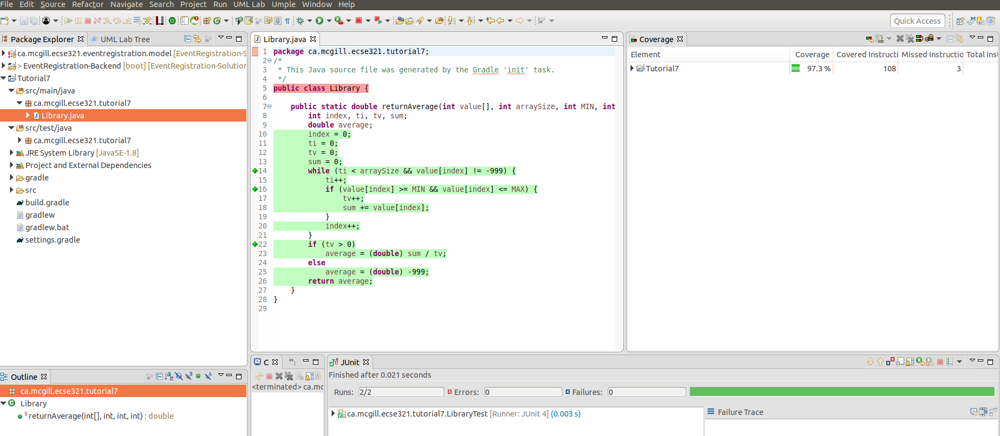

=== Assessing Code Coverage using EclEmma

This tutorial covers the basics of EclEmma and retrieves code coverage metrics using it.

==== Getting EclEmma

Install EclEmma as a plugin in your Eclipse IDE from link:https://www.eclemma.org/installation.html[here].
[NOTE]
The Spring Tools Suite (STS) version of Eclipse already ships with the plugin pre-installed, so you can skip this step if you are using STS.

==== Example Gradle Project for Assessing Code Coverage

We will create a Gradle project from scratch and be testing a simple method _returnAverage(int[], int, int, int)_ . 

. Create a new Gradle project in Eclipse by clicking on _File_ > _New_ > _Other_ +


. Under _Gradle_, choose Gradle Project +


. Click on _Next_, then name your project _tutorial7_, click on _Finish_ +
 +
[NOTE]
The project may take some time to be created.

. Create a new package instead of the default ones for both the source and test folders (e.g `ca.mcgill.ecse321.tutorial7`) and move the default generated classes (`Library` and `LibraryTest`) to this package. +


. Change the code in the `Library` class 
+
[source,java]
----
package ca.mcgill.ecse321.tutorial7;

public class Library {

	public static double returnAverage(int value[], int arraySize, int MIN, int MAX) {
		int index, ti, tv, sum;
		double average;
		index = 0;
		ti = 0;
		tv = 0;
		sum = 0;
		while (ti < arraySize && value[index] != -999) {
			ti++;
			if (value[index] >= MIN && value[index] <= MAX) {
				tv++;
				sum += value[index];
			}
			index++;
		}
		if (tv > 0)
			average = (double) sum / tv;
		else
			average = (double) -999;
		return average;
	}
}
----

. Change the code in the `LibraryTest` class 
+
[source,java]
----
package ca.mcgill.ecse321.tutorial7;

import static org.junit.Assert.assertEquals;

import org.junit.Test;

public class LibraryTest {
	
	@Test
	public void allBranchCoverageMinimumTestCaseForReturnAverageTest1() {
		int[] value = {5, 25, 15, -999};
		int AS = 4;
		int min = 10;
		int max = 20;		
		double average = Library.returnAverage(value, AS, min, max);
		assertEquals(15, average, 0.1);
	}
	
	@Test
	public void allBranchCoverageMinimumTestCaseForReturnAverageTest2() {
		int[] value = {};
		int AS = 0;
		int min = 10;
		int max = 20;		
		double average = Library.returnAverage(value, AS, min, max);
		assertEquals(-999.0, average, 0.1);
	}
}
----

==== Retrieving Code Coverage Metrics

[NOTE]
We can straightforwardly manage code coverage using JaCoCo inside Eclipse with no configuration if we are using EclEmma Eclipse plugin.

. Run the Test in coverage mode using Eclemma. Click on _LibraryTest_, _Coverage As_, _1 JUnit Test_ +


. Verify that we have 100% branch coverage. +


=== Event Registration Application Unit Code Coverage

. Check the code coverage of the service unit tests in the EventRegistration-Backend project.

. If you want to run the tests using gradle, use the _Jacoco plugin_ with plugin ID `jacoco`. After adding it to the _build.gradle_ file, the plugin section should look like the one below:
```gradle
plugins {
	id 'org.springframework.boot' version '2.2.4.RELEASE'
	id 'io.spring.dependency-management' version '1.0.9.RELEASE'
	id 'java'
	id 'jacoco'
}
```

. This new plugin gives us the `jacocoTestReport` task that can generate html reports. Try executing this task from the terminal and see the generated HTML files under _build/reports/jacoco/test/html/_!

. If you wish, you can check enforce a certain treshold on the test cases with this Jacoco plugin. With the definition below, the `./gradlew jacocoTestCoverageVerification` task will fail if code coverage is below 60%.
```gradle
jacocoTestCoverageVerification {
	violationRules {
		rule {
			limit {
				minimum = 0.6
			}
		}
	}
}
```
